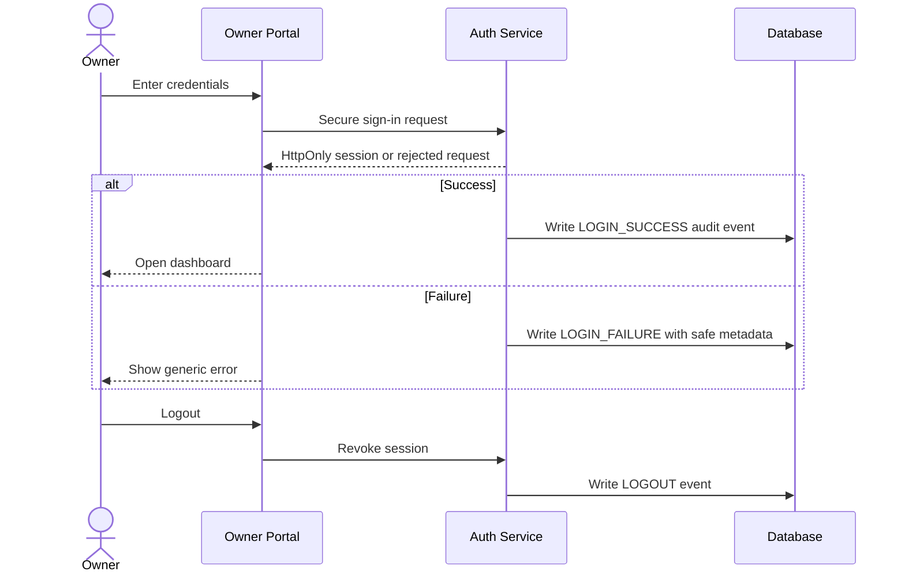
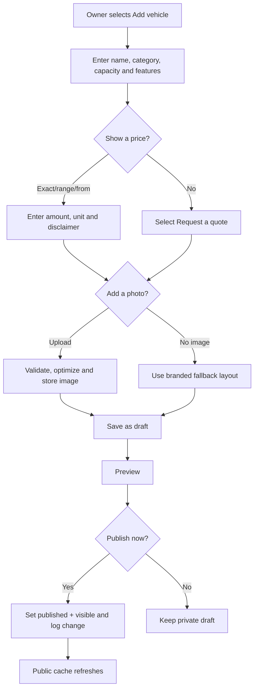
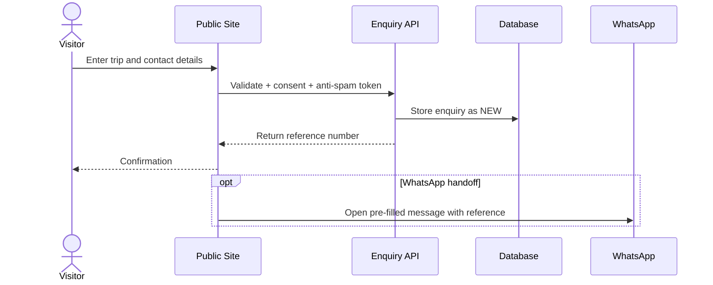
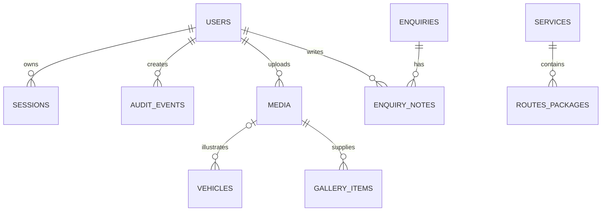
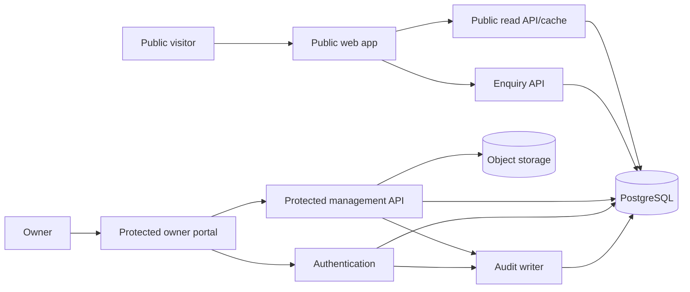
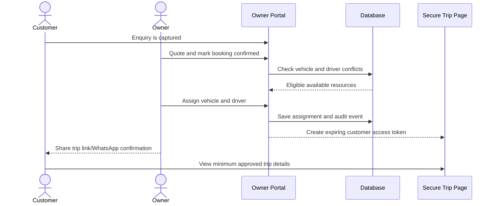
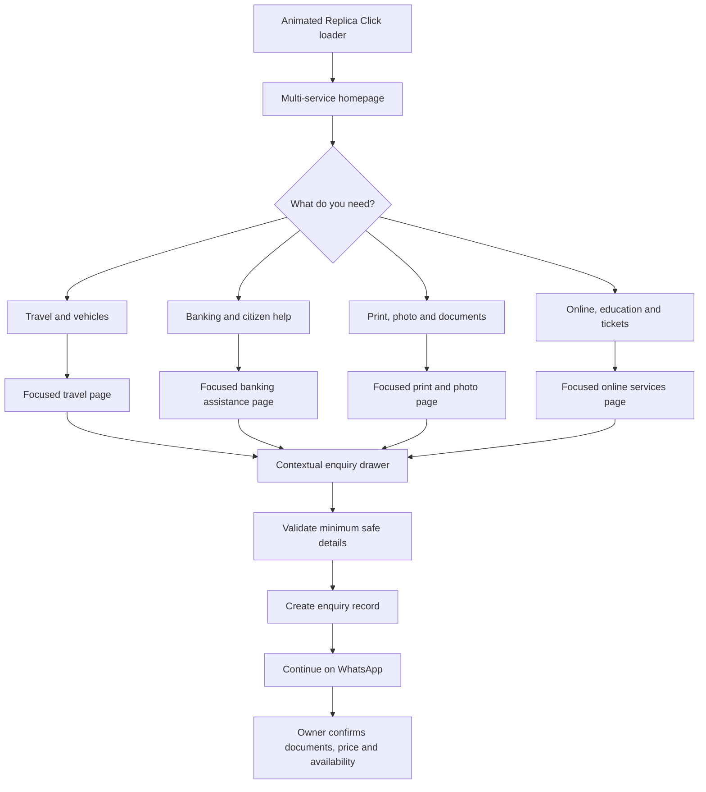

# Ankit Tours & Travels — Website Master Plan and Implementation Contract

**Project folder:** `D:\Data Science & Analytics\ankit tours nagpur`  
**Document status:** Planning and technical contract, updated after live production review
**Prepared:** 1 September 2026  
**Audience:** Owner, designer, developer, and any AI agent continuing the project

## Dual-Business Expansion — Implemented September 2026

The public website now uses a connected-hub design. Travel remains the primary identity, while Replica Click has a visually distinct blue/purple service centre in the same experience. This keeps a vehicle booking separate from an online-service request while retaining the shared Kondhali location, phone number, and owner trust.

```text
Public website
├── Ankit Tours & Travels
│   ├── Fleet / packages / routes / gallery
│   └── Travel quote → booking record → WhatsApp confirmation
└── Replica Click Online Center & Mini Bank
    ├── Searchable service categories
    ├── Expandable service details
    └── Safe enquiry → booking record → WhatsApp guidance
```

Replica Click safety contract:

1. Collect name, mobile, category, and a non-sensitive description only.
2. Never request or store Aadhaar numbers, account numbers, OTPs, PINs, passwords, or identity documents in this form.
3. “Request” means an enquiry—not an official application, completed transaction, guaranteed eligibility, or confirmed price.
4. Do not add “authorized”, government, bank, Aadhaar, or CSC partner claims without current documentary proof.
5. The owner confirms required documents, fees, eligibility, and completion privately.

The current catalogue is file-managed through `assets/data/replica-services.json`. A future owner-console phase can move it into a database table with draft/visible controls, ordering, audit logs, and explicit publish without changing the public component contract.

---

## 1. Purpose

Build a trustworthy, mobile-first transportation and tours website with two clearly separated experiences:

1. **Public website:** Customers browse services, vehicles, routes, packages, photographs, reviews, and contact or booking options.
2. **Private owner portal:** The owner securely signs in and manages what appears publicly without editing code. The owner can add, edit, hide, show, reorder, archive, or remove vehicles and other content; upload or omit car images; change prices; review enquiries; and inspect login, logout, and content-change logs.

This document defines the product, structure, data, security, workflows, design choices, acceptance criteria, and implementation phases. It is intentionally self-contained so another developer or AI can build the website without relying on the original conversation.

---

## 2. Known business information

| Field | Current value | Verification state |
|---|---|---|
| Business name | Ankit Tours & Travels | Owner must confirm exact spelling |
| Primary location | Kondhali, Nagpur, Maharashtra | Confirm public wording and postal address |
| Landmark | Near Bank of India, Kondhali | Confirm map pin |
| Mobile | 7276066532 | Confirm before publishing |
| WhatsApp | 7276066532 | Confirm WhatsApp Business availability |
| Existing service ideas | Airport transfer, outstation, Tadoba/Pench safari, pilgrimage, corporate travel, vehicle rental | Confirm each service |
| Existing vehicle ideas | Ertiga, Innova Crysta, Tempo Traveller | Confirm ownership/availability, model, capacity, and pricing |
| Languages in prototype | English, Hindi, Marathi | Confirm whether all three are required for launch |

### Claims that must not be published until proven

The current prototype contains `500+ trips`, `24x7 support`, `verified drivers`, `regularly sanitized vehicles`, `no hidden charges`, precise per-kilometre/package prices, and named testimonials. Treat every one of these as placeholder content. The owner must approve the wording and supply evidence or genuine customer permission. Do not invent reviews, vehicle photographs, capacities, prices, service coverage, or safety claims.

---

## 3. Audit of the existing prototype

### What is already useful

- Responsive one-page public layout with Home, About, Services, Fleet, Packages, Gallery, Testimonials, and Contact.
- English, Hindi, and Marathi text switching.
- Call and pre-filled WhatsApp enquiry actions.
- Fleet, packages, gallery, and testimonials are represented as structured data.
- Owner prototype can add, hide/show, and delete items.
- JSON seed data provides a useful content starting point.
- JavaScript syntax checks and JSON parsing pass as of this review.

### Critical problems

1. **The current owner page is not secure.** Its PIN is present in the HTML/JavaScript, displayed publicly, derived from the phone number, and can be passed through `?pin=7276`. Anyone can discover it.
2. **There is no server-side authentication.** Hiding the dashboard in a browser does not protect data or actions.
3. **There is no real login/logout log.** There is no authenticated session, session expiry, device history, or owner audit trail.
4. **Changes are browser-local.** `localStorage` changes are visible only in the same browser/profile. They do not automatically reach customers on other devices.
5. **The public page exposes the private admin URL and PIN.** Remove all admin hints and links from the public UI.
6. **Visitor enquiries are stored only in the visitor's browser.** That does not create an owner-visible lead record. WhatsApp opens, but sending the message is still the visitor's responsibility.
7. **Unsafe content rendering.** Owner-provided values are inserted with `innerHTML`; without sanitization this can permit stored cross-site scripting.
8. **Image uploads use base64 in localStorage.** Browser storage is small, inefficient, easy to lose, and unsuitable for a production gallery.
9. **Empty arrays fall back to seed data.** In `mergeData`, an intentionally empty collection cannot remain empty, so deleting all items can cause defaults to reappear.
10. **No edit or reorder workflow.** The prototype mostly supports add, visibility, and delete; it lacks full editing, drafts, publishing, rollback, and ordering.
11. **No authorization rules or protected API.** A production database must never rely on the UI to enforce permissions.
12. **Unverified content is presented as fact.** Placeholder prices, statistics, testimonials, and vehicle imagery could mislead customers.
13. **External stock images may depict incorrect vehicles or destinations.** Owner photos or carefully licensed, accurately labelled alternatives are preferred.
14. **No privacy/consent policy.** Collecting names, phone numbers, login events, or enquiry history requires clear purpose, retention, and access controls.
15. **Operational gaps.** No backups, rate limits, validation contract, error reporting, monitoring, accessibility audit, analytics consent, or recovery process.

### Prototype decision

Keep the current files as a visual/reference prototype until the owner chooses a design. Do not describe the current `admin.html` as private or production-ready. Production implementation should replace its PIN/localStorage model with authenticated APIs, cloud data, object storage, and audit logs.

---

## 4. Users, roles, and permissions

### Public visitor

No login should be required for ordinary customers. A visitor can view published content, change language, filter vehicles/packages, send an enquiry, call, open WhatsApp, and view map directions. Avoid customer accounts in version 1 because they add password, privacy, support, and deletion obligations without being necessary for a quote-first business.

### Owner

The owner signs in through an unadvertised route such as `/owner/login`. The owner can manage all content, prices, visibility, enquiries, media, settings, and activity logs.

### Optional staff role (later)

If staff access is eventually needed, use separate accounts rather than sharing the owner's password.

| Capability | Public | Staff (optional) | Owner |
|---|:---:|:---:|:---:|
| View published content | Yes | Yes | Yes |
| Submit enquiry | Yes | Yes | Yes |
| View enquiries | No | Assigned/all by policy | Yes |
| Add/edit site content | No | Limited | Yes |
| Publish/hide content | No | Optional | Yes |
| Delete/archive content | No | No or limited | Yes |
| Manage users/security | No | No | Yes |
| View audit log | No | Own/limited | Yes |
| Change business settings | No | No | Yes |

---

## 5. Recommended scope

### Version 1 — required

- Public responsive website.
- Secure owner email/password or magic-link login.
- Login, logout, failed-login, and content-change audit events.
- Fleet, service, package, route, gallery, testimonial, FAQ, and site-settings management.
- Add/edit/hide/show/reorder/archive controls.
- Optional image per vehicle with an intentional no-image presentation.
- Cloud image upload with type/size validation and optimized derivatives.
- Draft versus published state.
- Price display modes: exact, starting from, range, per kilometre/day, or ask for quote.
- Enquiry capture in the database plus optional WhatsApp handoff.
- Owner-visible enquiry list and statuses.
- English launch content; additional languages only after translations are reviewed.
- SEO, accessibility, performance, backup, and basic monitoring.

### Version 2 — useful additions

- Staff accounts and role-based access.
- Calendar availability blocks.
- Vehicle availability status.
- Scheduled publish/unpublish.
- CSV export for enquiries.
- Dashboard summaries and enquiry-source reporting.
- Automated email acknowledgement and owner notifications.
- PWA/installable owner dashboard.

### Not recommended for the first release

- Customer accounts merely to ask for a quote.
- Live vehicle tracking.
- Online payments before cancellation, refund, tax, reconciliation, and booking-confirmation rules exist.
- Real-time availability promises unless the owner will maintain the calendar reliably.
- Automatic safari permits; link or quote only unless a legitimate integration is available.

---

## 6. Public website information architecture

```text
Public website
├── Home
│   ├── Hero: business promise + Call + WhatsApp + Get Quote
│   ├── Verified trust points
│   ├── Featured vehicles
│   ├── Popular services/routes
│   ├── How booking works
│   ├── Genuine reviews
│   └── Final contact call-to-action
├── Fleet
│   └── Vehicle details: image optional, capacity, features, pricing mode
├── Services / Packages
│   ├── Airport transfer
│   ├── Outstation
│   ├── Safari
│   ├── Pilgrimage
│   ├── Corporate
│   └── Custom trip
├── About
├── Gallery (only if genuine media is available)
├── Contact / Enquiry
├── FAQ
├── Privacy policy
└── Terms / pricing disclaimer
```

### Public display rules

- Only `published` and `visible` records are returned by the public API.
- Draft, archived, deleted, internal notes, cost data, owner identity data, and audit events must never reach the public client.
- If an item has no photograph, render a branded vehicle-category illustration/icon or a clean text card. Never show a broken image.
- If a price is unknown, display `Request a quote`; never substitute `₹0`.
- A hidden item remains editable in the owner portal but disappears publicly.
- An archived item leaves normal owner lists but remains recoverable.
- Deletion is soft by default; permanent deletion is an explicit protected action.

---

## 7. Private owner portal structure

```text
Owner portal (/owner)
├── Login
│   ├── Email + password or magic link
│   ├── Forgot password
│   └── Rate-limit and generic error handling
├── Dashboard
│   ├── New enquiries
│   ├── Published/draft content counts
│   ├── Recent activity
│   └── Quick actions
├── Fleet
│   ├── Add/edit/duplicate vehicle
│   ├── Upload/replace/remove image
│   ├── Set capacity/features/price mode
│   ├── Draft/publish/hide/show/reorder/archive
│   └── Preview public card
├── Services, routes, and packages
├── Gallery/media library
├── Testimonials (approval and consent state)
├── Enquiries
│   ├── New / contacted / quoted / booked / closed / spam
│   ├── Notes
│   └── CSV export (later)
├── Page content and translations
├── Business settings
│   ├── Name, phones, address, hours, map, social links
│   ├── Homepage section visibility/order
│   └── SEO defaults
├── Activity and security log
├── Backup/export
└── Account
    ├── Change password
    ├── Active sessions
    └── Logout
```

### Owner usability rules

- Use plain forms; the owner should not edit JSON or source code.
- Autosave drafts, but require a clear **Publish changes** action for public updates.
- Show `Draft`, `Published`, `Hidden`, and `Archived` labels consistently.
- Provide a preview before publishing.
- Confirm destructive operations and prefer archive/restore.
- Record who changed what and when.
- Make the portal work well on an Android phone, not only desktop.

---

## 8. Core workflows

### Owner login, session, and audit



Passwords must never appear in logs. Store only necessary security metadata: account ID, event type, timestamp, approximate IP/user-agent if legally and operationally appropriate, success/failure, and request ID. Define a retention period, for example 90 days, and let the owner revoke active sessions.

### Add a new car with or without an image



### Hide versus archive versus delete

```text
Hide       = temporarily remove from public view; keep in normal owner list.
Archive    = remove from active owner workflow; retain for restore/history.
Soft delete= mark deleted; recoverable for a defined period.
Hard delete= permanently remove record/media after explicit confirmation and policy checks.
```

### Customer enquiry



Do not claim an enquiry is booked. A booking becomes confirmed only after an owner-defined confirmation action and any required payment/terms.

---

## 9. Data model

Use stable UUIDs, timestamps, and soft deletion. The exact database syntax may change, but the domain contract should remain.

### Main entities

| Entity | Important fields |
|---|---|
| `users` | id, email, display_name, role, status, created_at, last_login_at |
| `sessions` | id, user_id, created_at, expires_at, revoked_at, safe device metadata |
| `audit_events` | id, actor_user_id, event_type, entity_type, entity_id, before_json, after_json, request_id, created_at |
| `site_settings` | business name, phones, WhatsApp, address, hours, map URL, language settings, SEO, section order/visibility |
| `vehicles` | id, name, slug, category, capacity, luggage, AC/features, image_id nullable, pricing fields, status, visible, sort_order |
| `services` | id, title, slug, summary, details, image_id nullable, visible, featured, sort_order |
| `routes_packages` | id, service_id, origin, destination, duration, inclusions/exclusions, pricing fields, disclaimer, visible |
| `media` | id, storage_key, public_url/transform reference, alt text, width, height, mime type, bytes, created_by |
| `testimonials` | id, customer display name, route, review, rating, consent status, visible, sort_order |
| `gallery_items` | id, media_id, title, category, visible, sort_order |
| `faqs` | id, question, answer, visible, sort_order |
| `enquiries` | id/reference, name, phone, service, pickup, destination, trip date, passengers, message, consent, source, status, created_at |
| `enquiry_notes` | id, enquiry_id, author_id, note, created_at |
| `translations` | locale, entity_type, entity_id, field, translated_text, review_status |

### Reusable publishing fields

Content entities should share:

```text
status: draft | published | archived
visible: boolean
sort_order: integer
published_at: timestamp nullable
created_at / updated_at
created_by / updated_by
deleted_at: timestamp nullable
```

### Pricing contract

Avoid storing price only as a formatted string. Use:

```text
display_mode: quote | exact | starting_from | range
amount_min: decimal nullable
amount_max: decimal nullable
currency: INR
unit: trip | km | day | package | airport_transfer
includes: text/list
excludes: text/list
disclaimer: text
effective_from: date nullable
```

This prevents inconsistent strings and permits predictable public formatting.

### Entity relationship overview



---

## 10. Technical architecture options

### Option A — recommended: managed full-stack application

**Frontend:** React-based framework with server rendering/static generation  
**Backend:** Server routes/actions  
**Database/Auth/Storage:** Supabase (PostgreSQL, Auth, Storage) or equivalent managed services  
**Hosting:** Vercel/Netlify-compatible deployment

Advantages:

- Secure real owner accounts and server-enforced permissions.
- Changes appear across all devices immediately.
- Structured database, media storage, audit logs, backups, and future staff roles.
- Strong SEO and performance are possible.

Trade-offs:

- Requires accounts/configuration and modest ongoing cloud administration.
- Free tiers have limits and policies that must be checked at implementation time.

### Option B — headless CMS

Use a hosted CMS for content plus a custom public frontend.

Advantages: mature editing experience, image handling, drafts, and permissions.  
Trade-offs: enquiry workflow and custom audit requirements may need additional services; free-plan limits and vendor dependence.

### Option C — static site plus JSON/manual publishing

Continue the current export-and-redeploy approach.

Advantages: cheapest and simplest hosting.  
Trade-offs: no secure self-service cloud dashboard, no real-time multi-device changes, weak logs, and manual deployment. This does **not** satisfy the full request.

### Architecture recommendation

Choose Option A. A suitable conceptual layout is:



The public browser must never contain database administrator keys. Authorization belongs in server/database policies, not merely in hidden buttons.

---

## 11. Visual design directions

The owner should select one direction before high-fidelity implementation.

### Direction 1 — Local Trust (recommended)

- Deep navy, saffron, warm cream, and white.
- Strong real vehicle photography where available.
- Clear route/service cards, phone and WhatsApp actions.
- Friendly but professional typography and minimal animation.
- Best for families, airport customers, pilgrimage groups, and local trust.

### Direction 2 — Premium Chauffeur

- Charcoal/navy, ivory, and restrained gold.
- Large editorial photography and more whitespace.
- Fleet-first experience emphasizing comfort and corporate service.
- Best if the actual fleet and service quality support a premium position.

### Direction 3 — Explorer / Safari

- Forest green, sand, sunrise orange, and navy.
- Destination-led cards for Tadoba, Pench, pilgrimage, and regional circuits.
- Maps, itinerary storytelling, and package imagery.
- Best if tourism packages are a major revenue source; less suitable if most work is basic taxi rental.

### Direction 4 — Utility Booking

- Clean white/blue interface, minimal decoration, compact cards.
- Immediate route, date, passenger, and vehicle enquiry controls.
- Fastest experience on low-end phones and slower networks.
- Best if conversion speed matters more than a rich brand presentation.

### Shared visual requirements

- Mobile-first at 360 px and upward.
- 44 px minimum touch targets.
- High contrast, visible keyboard focus, semantic headings, meaningful alt text.
- Respect reduced-motion preferences.
- Do not make glassmorphism the dominant reading surface; blur can reduce contrast and performance.
- Provide intentional empty/no-image states.
- Use local typography fallbacks so the page remains readable if Google Fonts fails.

---

## 12. Security, privacy, and audit requirements

- Use proven managed authentication; never store plaintext passwords or a PIN in frontend code.
- Prefer secure, `HttpOnly`, `Secure`, `SameSite` session cookies where the stack supports them.
- Require TLS in production.
- Rate-limit login, password reset, enquiry, upload, and write endpoints.
- Add CSRF protection where applicable and strict authorization on every mutation.
- Validate on the server: type, length, enumeration, numeric range, URL scheme, file MIME, file signature, dimensions, and size.
- Escape output and sanitize any permitted rich text. Avoid rendering untrusted strings through raw HTML.
- Restrict uploads to approved image types; generate safe filenames and optimized variants; consider metadata stripping.
- Record significant activity: login success/failure, logout, password reset, create, update, publish, hide/show, reorder, archive, restore, delete, export, and settings change.
- Audit logs should be append-oriented and not editable through ordinary content forms.
- Do not log passwords, reset tokens, full session tokens, or unnecessary sensitive enquiry content.
- Back up the database and media; document restore testing.
- Define privacy notice, enquiry retention, deletion process, and access policy before launch.
- Add bot protection/honeypot to enquiry forms without making legitimate mobile use difficult.

---

## 13. Content-management rules by module

| Module | Owner controls | Public behavior |
|---|---|---|
| Fleet | Add/edit, optional photo, capacity, features, price mode, featured, order, visibility, archive | Published visible vehicles only; fallback when photo absent |
| Services | Title, description, icon/image, coverage, order, featured, visibility | Service cards/detail pages |
| Packages/routes | Origin/destination, duration, vehicle, inclusions, exclusions, price mode, validity | Clear quote CTA and disclaimer |
| Gallery | Upload, caption, alt text, category, crop/focal point, order, visibility | Optimized responsive images |
| Testimonials | Text, name display, rating, route, consent, visibility | Only approved genuine reviews |
| FAQ | Question/answer/order/visibility | Search-friendly accordion |
| Pages/settings | Business identity, contact, hours, map, social, section order/visibility | Centralized consistent values |
| Enquiries | View, filter, update status, note, archive/export | Visitor sees confirmation only |
| Languages | Edit translation, mark reviewed, enable/disable locale | Fall back to reviewed default language |

---

## 14. Validation and operational rules

- Phone: store normalized international form and format for display.
- Vehicle name: required, bounded length, unique slug.
- Price: valid decimal/range and explicit unit; never rely on free text alone.
- Images: recommended WebP/AVIF derivatives, responsive sizes, descriptive alt text, maximum upload limit.
- URLs: allow only `https`, and specifically validated `tel`/WhatsApp/map links where needed.
- Testimonials: consent flag and source note required before publishing.
- Translations: never auto-publish machine translations without review.
- Business settings: one canonical source for phone/address; avoid hard-coding values in multiple components.
- Enquiries: validate date, passenger count, phone, consent, and message limits; use a human-readable reference.
- Availability: do not promise a vehicle merely because it is visible; visibility and availability are separate concepts.

---

## 15. SEO, analytics, accessibility, and performance

### SEO

- Unique title/description and canonical URL.
- Open Graph image using an approved business asset.
- LocalBusiness/TaxiService-style structured data only with verified fields.
- Sitemap, robots file, clean slugs, location/service content without keyword stuffing.
- Consistent business name, address, and phone.

### Analytics

Track useful, non-sensitive events: call click, WhatsApp click, enquiry success, vehicle/package interest, language selection, and source campaign. Do not send phone numbers or enquiry messages to analytics. Obtain consent where legally required.

### Accessibility acceptance

- Keyboard navigation throughout public and owner interfaces.
- Form labels, instructions, useful error messages, and status announcements.
- Sufficient contrast and non-colour state indicators.
- Modal focus trapping/return and Escape handling.
- Correct language attributes and reviewed translations.
- Automated checks plus manual keyboard and screen-reader spot checks.

### Performance targets

- Optimize hero/media and avoid oversized stock images.
- Lazy-load below-fold images; reserve dimensions to avoid layout shift.
- Keep public JavaScript small; owner code should not load on public pages.
- Target good Core Web Vitals on mid-range mobile and throttled networks.

---

## 16. Implementation phases

### Phase 0 — owner decisions and evidence

- Confirm business identity, phone, address/map, operating hours, service area, fleet, capacities, and languages.
- Replace or remove every unverified statistic, review, price, and claim.
- Collect logo and genuine vehicle/destination photographs with permission.
- Select design direction and technical option.

### Phase 1 — foundation

- Preserve the prototype as reference or move it into a clearly named legacy/prototype folder after approval.
- Create the production app structure, environment example, formatting/linting/testing, and deployment environments.
- Create database schema, migrations, seed strategy, storage buckets, and authorization policies.
- Configure the first owner account through a secure bootstrap process.

### Phase 2 — public experience

- Implement shared design system and public information architecture.
- Build fleet/services/packages/FAQ/contact views from the public data layer.
- Implement responsive optional-image states, WhatsApp/call actions, SEO, and accessibility.

### Phase 3 — owner portal

- Implement authentication, session expiry/logout, dashboard, CRUD forms, draft/publish, visibility, ordering, archive/restore, preview, media management, and site settings.
- Implement audit events and active-session controls.

### Phase 4 — enquiries and notifications

- Create server-validated enquiry endpoint, anti-spam, consent, reference number, database storage, owner workflow, and optional notifications/WhatsApp handoff.

### Phase 5 — verification and launch

- Unit/integration/end-to-end tests.
- Authorization tests proving public and unauthorized users cannot mutate/read private data.
- Mobile, browser, accessibility, performance, SEO, broken-link, upload, backup/restore, and failure-state checks.
- Owner acceptance review on staging.
- Production deployment, domain/DNS, monitoring, and post-launch smoke test.

---

## 17. Minimum acceptance criteria

### Public

- A visitor can browse all published content without login on mobile and desktop.
- Hidden/draft/archived records cannot be retrieved through the public API.
- Call, WhatsApp, map, navigation, language, and enquiry interactions work.
- Missing images and empty sections degrade gracefully.
- No unverified claims or fake testimonials remain.

### Owner

- An unauthenticated user cannot access owner data or mutations, even by calling APIs directly.
- Owner can securely login/logout and recover access.
- Owner can add, edit, preview, publish, hide/show, reorder, archive, and restore each supported content type.
- Vehicle photo is optional; upload/replace/remove all work.
- Changes appear publicly only when published and visible.
- Owner can view/filter enquiries and change their statuses.
- Relevant authentication and content actions appear in the audit log.
- Validation errors do not discard form work.

### Reliability/security

- Production secrets are absent from source and browser bundles.
- Backups exist and a restore procedure is documented/tested.
- Rate limiting, upload restrictions, server validation, and authorization tests pass.
- Error pages/messages do not reveal secrets or stack traces.

---

## 18. Required owner decisions before implementation

Record answers in this table; do not guess them during development.

| Decision | Options / requested answer | Current recommendation |
|---|---|---|
| Design | Local Trust / Premium Chauffeur / Explorer / Utility | Local Trust |
| Stack | Managed full-stack / CMS / static | Managed full-stack |
| Owner login | Email+password / magic link | Managed email login; add MFA if practical |
| Customer login | None / required | None for v1 |
| Languages | English / +Hindi / +Marathi | English first; enable reviewed translations |
| Pricing | Exact / from / range / quote per item | Per-item mode |
| Images | Owner photos / approved stock / no-image fallback | Owner photos + fallback |
| Enquiries | Database + WhatsApp / WhatsApp only | Database + optional WhatsApp handoff |
| Public routes | Confirm destinations and coverage | Owner to supply |
| Operating hours | Fixed / 24x7 / by appointment | Owner to confirm |
| Reviews | Genuine supplied reviews / hide section | Hide until genuine reviews are approved |
| Staff accounts | Now / later | Later |
| Online payment | Now / later / never | Later, only with policies |
| Domain/hosting | Existing domain or new | Owner to provide |
| Data retention | Enquiries and audit-log periods | Define before launch |

---

## 19. Handoff instructions for the next developer or AI

1. Read this entire document before editing code.
2. Inspect the current project; treat it as a prototype, not a secure backend.
3. Obtain answers to Section 18 and verified content from Section 2/Phase 0.
4. Do not publish placeholder prices, claims, images, or testimonials.
5. Do not retain the exposed PIN or query-string bypass in production.
6. Do not simulate cloud persistence with `localStorage` or call client-side hiding “security.”
7. Keep public queries and owner mutations separate, with server/database authorization.
8. Use migrations and seed data; do not edit production tables manually without a documented process.
9. Preserve an audit trail and soft-delete/restore behavior.
10. Verify through tests and a staging owner walkthrough before production deployment.

---

## 20. Final recommendation

Build a **Local Trust** public design and a separate mobile-friendly owner portal using a managed full-stack architecture. Launch without customer accounts, fake metrics, unverified reviews, or forced car images. Give the owner genuine no-code control over structured content, but protect it with real authentication, server-enforced authorization, managed media storage, drafts/publishing, reversible content states, enquiry management, and append-oriented activity logs.

The present project is a valuable UI/content prototype. It is not yet suitable for real private administration or shared production editing; the first engineering priority is replacing the exposed PIN and browser-only persistence with the architecture described above.

---

## 21. Production review update — 1 September 2026

### Verified live state

The Vercel production site and local checkout at commit `c100d6f` were reviewed. The following behavior is currently observable:

- The public page renders Fleet (3), Packages (4), Gallery (6), and Testimonials (3) from the API-backed data path.
- Public navigation, English/Hindi/Marathi controls, WhatsApp/call actions, two enquiry forms, map, gallery lightbox, and responsive sections are present.
- The public site is currently light-only; there is no day/night theme control and no declared colour-scheme support.
- The admin page currently exposes its PIN in the placeholder and help text, describes the URL query bypass, and uses a frontend PIN gate.
- The public Fleet section and footer link directly to the admin page; the Fleet section also publishes the PIN.
- API-backed CRUD and enquiry storage have been added, but the protection model described in earlier sections has not been implemented.

### Urgent production findings

These issues take priority over theme or driver features:

1. **Rotate the Neon database credential again immediately.** The database initialization script contains a complete database connection fallback in committed source. Remove the fallback, read only `process.env.DATABASE_URL`, rotate the credential, and purge it from Git history if the repository was public or shared. Rotation is required even if the `.env` file was ignored.
2. **Protect all write APIs.** Fleet, package, gallery, and testimonial `POST`, `PUT`, and `DELETE` operations currently have no server-side authentication or authorization. A visitor can bypass the visual admin gate and call them directly.
3. **Protect enquiry reads.** `GET /api/bookings` currently returns customer names, phone numbers, messages, and dates without owner authentication. Disable public GET access immediately and require an authenticated owner session.
4. **Remove the exposed PIN and query bypass.** Remove the PIN from `index.html`, `admin.html`, JavaScript, README instructions, placeholders, public footer, and URL-query handling. An environment variable named `ADMIN_PIN` does not secure routes unless the server verifies it and establishes a protected session.
5. **Restrict CORS.** Do not return `Access-Control-Allow-Origin: *` for protected content or mutation endpoints. Prefer same-origin requests and an explicit production origin where cross-origin access is necessary.
6. **Stop returning raw server errors.** Database/API errors should receive a request ID and a safe public message; detailed errors belong in protected server logs.
7. **Add server validation and safe rendering.** Bound lengths and values, validate URLs/uploads, and stop inserting owner-controlled data as unsanitized HTML.
8. **Replace base64 database images.** Use managed object storage and store only media metadata/URLs in PostgreSQL.
9. **Verify public claims.** The live site publishes `since 2016`, `500+`, `24/7`, `verified drivers`, `sanitized vehicles`, `live tracking`, exact prices, and named reviews. Confirm or remove each claim.

### Recommended delivery order from the current deployed state

```mermaid
flowchart LR
    A[Rotate leaked credential] --> B[Remove secret from source/history]
    B --> C[Server-side owner authentication]
    C --> D[Protect writes and booking reads]
    D --> E[Validation, CORS, rate limits and safe errors]
    E --> F[Day/night theme system]
    F --> G[Drivers and availability]
    G --> H[Booking assignment and customer trip link]
    H --> I[Accessibility, performance and owner acceptance]
```



Do not add private driver records to the existing unprotected APIs.

---

## 22. Day/night theme specification

### User experience

- Add an accessible theme button in the public header and owner top bar.
- Support three logical choices: `Light`, `Dark`, and `System`. The compact header button can toggle Light/Dark, while a small settings menu can expose System.
- On first visit, use `prefers-color-scheme` unless a saved choice exists.
- Save the visitor's preference locally under a non-sensitive key such as `att_theme`.
- Apply the theme before first paint to prevent a bright flash in dark mode.
- Set `<meta name="color-scheme" content="light dark">` and theme-colour metadata appropriate to the active mode.
- Give the button an explicit label such as `Switch to dark theme`; do not rely only on a sun/moon icon.
- Theme selection is a device preference and does not need to be stored in Neon.

### Design direction

Retain the local-trust blue/orange brand but reduce the current glass effect. Use glass only for the sticky header and selected hero surfaces; use solid, high-contrast cards for long content and the owner portal.

| Token | Light | Dark |
|---|---|---|
| Page background | Warm off-white `#F7F5F0` | Deep navy-charcoal `#0B1220` |
| Surface | `#FFFFFF` | `#121C2B` |
| Elevated surface | `#F0F4F8` | `#182538` |
| Primary text | `#172033` | `#F4F7FB` |
| Muted text | `#5B687A` | `#A9B6C8` |
| Brand blue | `#0F4C81` | `#62B5F2` |
| Action orange | `#E87500` | `#FFB14A` |
| Border | `#DCE3EA` | `#2A3B51` |
| Success | `#18794E` | `#56D39B` |
| Danger | `#B42318` | `#FF8178` |

Final colours must pass WCAG contrast tests for their actual text/background pairs; token values may be adjusted during visual verification.

### Technical contract

```text
document root: data-theme="light" | "dark"
CSS variables: semantic tokens only (background, surface, text, accent, border)
default: system preference
persistence: localStorage att_theme
reactivity: update if system changes only while user choice is System
motion: short colour transition, disabled for prefers-reduced-motion
```

Images, map embeds, shadows, focus rings, tables, form fields, dialogs, success/error messages, and the WhatsApp control must be checked in both modes. Avoid simply inverting images or reducing all dark-mode contrast.

### Theme acceptance tests

- Correct theme appears before visible content paints.
- Choice persists across reloads and public/admin navigation.
- System choice follows operating-system changes.
- Keyboard and screen-reader users can identify and activate the control.
- No unreadable text, invisible borders, bright white form controls, or low-contrast placeholder text remains.
- Both modes work at mobile and desktop breakpoints.

---

## 23. Drivers, vehicle availability, and trip assignment

### Privacy boundary

A driver is not ordinary public content. Driver phone numbers, addresses, licence numbers/images, government identity, emergency contacts, schedules, internal notes, and precise live location are private operational data. They must not be returned by public list APIs or exposed in page source.

The public website may show only general trust information that the owner has verified, such as a driver display name/first name, approved profile photograph, languages, years of experience, or a general verification badge. Booking-specific contact details should appear only after a driver is assigned to a confirmed trip.

### Owner portal: Drivers module

```text
Drivers
├── Active drivers
├── Add/edit driver
│   ├── Internal identity and contact
│   ├── Public-approved profile fields
│   ├── Licence/document expiry metadata
│   ├── Skills, languages and vehicle eligibility
│   └── Notes (private)
├── Availability calendar
├── Assigned/upcoming trips
├── Expiring documents alerts
├── Suspend/archive/restore
└── Driver activity audit
```

### Driver fields

| Field group | Example fields | Visibility |
|---|---|---|
| Identity | legal name, internal driver code, date joined | Owner/staff only |
| Contact | phone, alternate phone, emergency contact | Owner/staff; assigned customer receives approved trip contact only |
| Public profile | display name, approved photo, languages, experience summary | Optional public/booking display |
| Compliance | licence number, class, expiry, document storage key, verification state/date | Owner only; never public document URLs |
| Operations | active status, eligible vehicle categories, home/base area, notes | Owner only |
| Availability | status, start/end, reason category, source, updated by | Owner/staff; public receives coarse availability only |
| Safety | suspension state and private reason | Owner only |

Do not store more identity information than the business genuinely needs. Encrypt or use protected storage for sensitive documents, restrict access, log access, and define deletion/retention rules.

### Availability states

Keep vehicle status and driver status separate:

```text
Vehicle: available | held | assigned | maintenance | inactive
Driver: available | held | assigned | leave | unavailable | inactive
Booking: enquiry | quoted | held | confirmed | in_progress | completed | cancelled
```

A trip can be confirmed only when both an eligible vehicle and driver are available for the time window. Use database transactions or conflict checks to prevent double assignment.

Public customers should see coarse wording such as `Available on request`, `Limited availability`, or `Contact for this date`. Do not expose the driver's calendar or guarantee availability until owner confirmation.

### Assignment workflow



### Customer-facing trip information

After assignment, show only what helps the passenger identify the trip:

- Booking reference and trip date/time.
- Pickup summary and destination.
- Vehicle make/model, colour, and registration number or masked form according to owner policy.
- Driver display name and approved profile photograph.
- Trip contact number or masked/call-relay option if available.
- `Call driver` and `Contact office` actions near pickup time.
- Safety/help instructions and a clear note that assignments can change.

Use a random, high-entropy, expiring trip-view token—not a sequential booking ID or phone number. Allow the owner to revoke/regenerate the link. Hide details after completion plus a defined grace period. Log link creation and revocation; avoid invasive customer tracking.

### Reassignment

If a driver or vehicle changes, retain assignment history, record the reason, notify the customer through an approved channel, invalidate obsolete trip details where necessary, and never silently overwrite the audit trail.

### Suggested schema additions

| Entity | Core fields |
|---|---|
| `drivers` | id, internal_code, legal_name, display_name, phone, public_bio, photo_media_id, languages, active_status, verification fields, timestamps |
| `driver_documents` | id, driver_id, type, protected_storage_key, expiry_date, verification state, reviewed_by/at |
| `availability_blocks` | id, resource_type, resource_id, start_at, end_at, status/reason, created_by |
| `bookings` | expand with reference, status, pickup/destination, start/end, passengers, customer consent, timestamps |
| `booking_assignments` | id, booking_id, vehicle_id, driver_id, start/end, status, assigned_by/at, ended_at |
| `trip_access_tokens` | id, booking_id, token_hash, expires_at, revoked_at, created_by |
| `notification_events` | id, booking_id, channel, template, destination reference, status, sent_at |

Do not store raw trip access tokens; store their cryptographic hash and show/send the original only when created.

### Driver/availability acceptance tests

- Public APIs never return private driver fields or document URLs.
- Owner can add/edit/suspend/archive drivers and see expiring-document alerts.
- Owner can block availability for vehicles and drivers.
- System prevents overlapping active assignments.
- Customer trip links are unguessable, expire, can be revoked, and expose only approved fields.
- Reassignment preserves history and creates audit events.
- No customer can access another booking by changing an ID in the URL.

---

## 24. Owner dashboard improvements from the current build

Add these dashboard areas after authentication is repaired:

1. **Today:** pickups, drop-offs, unassigned confirmed trips, and time conflicts.
2. **Enquiries:** new, contacted, quoted, confirmed, closed, and spam.
3. **Availability board:** vehicles as rows, dates/time as columns, assignments and maintenance blocks.
4. **Drivers:** available, assigned, on leave, inactive, and documents expiring soon.
5. **Content:** drafts, hidden items, missing images, prices needing review, and untranslated changes.
6. **Activity:** recent logins, failed login warnings, publishes, deletes, assignments, and exports.
7. **Quick actions:** new booking, block vehicle, add driver, add vehicle, update price, and publish notice.

Avoid placing sensitive customer or driver details on the first screen when the owner portal opens in a public place. Provide a privacy screen option that masks phone numbers until tapped.

---

## 25. Revised implementation backlog

| Priority | Work item | Completion signal |
|---|---|---|
| P0 | Rotate and remove committed database credential | Old credential rejected; repository/history scan clean |
| P0 | Replace frontend PIN with server-side authentication/session | Direct API mutations and booking reads return 401/403 without owner session |
| P0 | Remove admin PIN/link disclosures and query bypass | No PIN/admin instructions in public DOM or client source |
| P0 | Protect API errors, CORS, validation, rate limits | Security tests pass and sensitive errors are not returned |
| P1 | Add theme tokens and Light/Dark/System control | Theme acceptance tests pass on public and owner views |
| P1 | Replace base64 uploads with managed media storage | Optimized upload/replace/remove works across devices |
| P1 | Add proper bookings workflow/statuses | Owner can move enquiry through confirmed/completed lifecycle |
| P1 | Add drivers and separate availability | Private driver CRUD and conflict-safe assignment work |
| P1 | Add secure customer trip view | Expiring/revocable link exposes minimum approved details |
| P2 | Add owner dashboard, audit UI, session management | Owner can inspect operations and revoke sessions |
| P2 | Verify/replace claims, testimonials, prices, photos | Owner-approved content register has no placeholders |
| P2 | Accessibility, responsive and performance QA | Agreed automated/manual checks pass |

### Updated definition of “ready”

The site is not production-ready merely because Vercel reports `READY` or Neon responds. It is ready when secrets are rotated, private routes are actually authorized, customer/driver data is protected, public claims are verified, theme and core workflows pass their acceptance tests, and the owner completes a staging walkthrough on both phone and desktop.

---

## 26. Implemented visual direction — Deccan Road Edition

The local implementation now includes a signature-style loader, a locally illustrated Nagpur/Kondhali road hero, a Central India route map, locally labelled destination artwork, expandable service and booking-detail panels, and code-native 3D vehicle visuals. Fleet records now support `display_mode` (`3d`, `photo`, or `auto`), `model_color`, and `vehicle_type`; the owner form exposes these choices and public cards respect them. Generic Unsplash seed/gallery placeholders render as branded local travel posters instead of presenting unrelated foreign imagery. Real owner-supplied non-placeholder gallery photos remain supported.

The 3D vehicles are intentionally CSS/HTML rather than heavy WebGL models: they load quickly on low-end phones, support dark mode, animate without an additional runtime, and degrade safely. If photorealistic rotatable models are required later, add optimized GLB assets only after measuring mobile download and GPU costs.

---

## 27. Multi-Service Hub Redesign Contract — Planned 2 September 2026

### 27.1 Status and intent

This section is an implementation plan, not a claim that the redesign is already built. It supersedes the current public information architecture where tours, vehicles, online services, packages, routes, and other material appear as one long page. Existing security, privacy, authentication, publishing, driver, booking, and audit requirements elsewhere in this document remain mandatory.

The new website should present the owner's full store as one trusted local service hub. The Replica Click logo becomes the umbrella public brand; Ankit Tours & Travels remains a named service division inside it. Visitors first choose the kind of help they need, then enter a focused page that contains only information and actions relevant to that service.

Primary design goals:

1. Make the homepage understandable in five seconds.
2. Group services by customer intent rather than expose a long raw list.
3. Give every group its own visual language while keeping one coherent design system.
4. Minimize clutter through progressive disclosure, contextual popups, and focused service pages.
5. Keep important contact actions reachable without covering content.
6. Make mobile the primary layout, not a compressed desktop page.

### 27.2 Recommended brand hierarchy

```text
Replica Click — umbrella store identity
│
├── Ankit Tours & Travels
│   ├── Vehicle rental
│   ├── Airport and local travel
│   ├── Outstation and pilgrimage
│   └── Safari and group travel
│
├── Banking & Citizen Assistance
│   ├── Mini-bank / AEPS assistance
│   ├── PAN and Aadhaar-related assistance
│   ├── Government and farmer services
│   └── Bills, recharge and transport cards
│
├── Print, Photo & Document Studio
│   ├── Xerox and printing
│   ├── Passport/photo services
│   ├── Scan and document preparation
│   └── Lamination
│
└── Education, Tickets & Business Help
    ├── Education applications
    ├── Ticket assistance
    ├── Business-related services
    └── Other guided online work
```

Do not rename Ankit Tours & Travels to Replica Click. The homepage header may use the Replica Click logo with the descriptor `Online Center • Mini Bank • Tours & Travels`, while the travel page prominently uses `Ankit Tours & Travels — a Replica Click service`.

### 27.3 Target navigation and routes

Use real routes/pages rather than scrolling every visitor through one oversized document.

| Route | Purpose | Primary action |
|---|---|---|
| `/` or `index.html` | Multi-service homepage and group selector | Explore a service group |
| `/travel/` | Ankit Tours, fleet, routes, packages and trip enquiry | Request travel quote |
| `/banking-services/` | Banking, PAN, Aadhaar, farmer and government assistance | Ask required documents |
| `/print-photo/` | Xerox, printing, photo, scanning and lamination | Request print/photo service |
| `/online-services/` | Education, tickets, bills, business and other online work | Request online assistance |
| `/contact/` | Shared location, hours, directions and contact choices | Call or open WhatsApp |
| `/track/` | Future secure booking/trip lookup only | Open protected trip information |
| `/admin/` | Authenticated owner console; never linked as a public CTA | Owner login |

If the project remains static HTML, implement folders with `index.html` files. If it moves to a router/framework, preserve these clean URLs and ensure direct refresh works on Vercel.

### 27.4 End-to-end public workflow



The form must adapt to its source page. Travel asks for date, route, passengers, and vehicle preference. Print asks for print type, colour/black-and-white, approximate pages, size, and collection time—but not document upload in the initial public version. Banking and citizen assistance asks only for the service category and a safe description. Sensitive identifiers and credentials are never collected.

### 27.5 Homepage composition

The homepage is a directory and trust surface, not the complete catalogue.

#### A. Loader

- Use the supplied transparent Replica Click logo as the central mark.
- Animate the gold orbit as a short path sweep and reveal `Replica Click` with a restrained signature/wipe effect.
- Follow with the descriptor `Online Center • Mini Bank • Tours & Travels`.
- Target duration: 700–1,200 ms on first visit; 300–500 ms on internal navigation if transitions are used.
- Never block longer than 1,800 ms. Skip immediately for `prefers-reduced-motion`.
- Store only a session flag so repeat page loads do not replay the full animation.

#### B. Header

- Left: compact Replica Click logo lockup.
- Centre on desktop: Home, Services, About, Contact.
- Right: language selector, day/night theme control, and one `Get help` button.
- Mobile: logo, theme button, and menu button. Open navigation in a glass sheet grouped by service family.
- Header hides on downward scroll and returns on upward scroll or keyboard focus.

#### C. Hero

- Eyebrow: `Kondhali's local service hub`.
- Heading: one concise promise covering online work, printing, banking assistance, and travel.
- Two actions only: `Explore services` and `Call 7276066532`.
- Use the Replica Click logo as a deliberate brand object, not a large empty poster image.
- Optional background: subtle route lines connect icons for a car, bank, document, and computer. Avoid generic foreign travel photographs.

#### D. Main service-group selector

Display four large cards only:

| Group card | Visual motif | Preview copy | Destination |
|---|---|---|---|
| Tours & Vehicles | CSS 3D vehicle, road line, warm amber | Rentals, airport, outstation, safari and pilgrimage | `/travel/` |
| Banking & Citizen Help | Secure vault/grid, blue and cyan | Mini-bank assistance, cards, schemes and applications | `/banking-services/` |
| Print, Photo & Documents | Paper stack/printer frame, violet and coral | Xerox, print, photos, scan and lamination | `/print-photo/` |
| Online Services | Cursor/network motif, teal and indigo | Education, tickets, bills and business support | `/online-services/` |

Each card contains one sentence, three example chips at most, and one `Explore` control. On hover/focus the illustration may tilt by 1–2 degrees, the border glow may move, and the arrow may translate 4 px. On touch, the card opens directly; never require hover to reveal essential information.

#### E. Trust and utility strip

Show only verified facts:

- Near Bank of India, Kondhali.
- Open 9:00 AM–9:00 PM, if owner reconfirms the hours.
- Call and WhatsApp number.
- Languages supported.
- `What to bring` guidance is confirmed after enquiry.

Do not show fake customer counts, ratings, government logos, bank logos, authorization badges, or “instant approval” statements.

#### F. How it works

Use three short steps: `Choose a service` → `Tell us what you need` → `Owner confirms documents, price or availability`. This section should explicitly distinguish an enquiry from a completed government application, banking transaction, or confirmed travel booking.

#### G. Location and footer

Use one compact map/location card, opening hours, call, WhatsApp, and directions. Footer columns should be grouped as Service pages, Store information, and Legal/privacy. Do not repeat the complete service list.

### 27.6 Focused service-page templates

Every service page follows the same structural rhythm:

```text
Context header and breadcrumb
→ Service-specific hero
→ Grouped catalogue/filters
→ Pricing or requirements guidance where verified
→ Contextual trust/safety note
→ Related services from the same family
→ Enquiry action
→ Shared location/footer
```

#### Travel page

- Retain the Deccan Road visual direction and CSS 3D/photo vehicle choice.
- Group catalogue into `Local & Airport`, `Outstation`, `Safari`, `Pilgrimage`, and `Group/Corporate`.
- Keep fleet availability and driver information private until a booking is confirmed, as defined earlier in this document.
- Packages use concise cards on mobile; comparison table is optional on wide screens.
- Sticky contextual action: `Request travel quote`.

#### Banking and citizen-assistance page

- Use calm blue/cyan rather than aggressive financial imagery.
- Group into `Mini Bank & AEPS Assistance`, `Identity & PAN`, `Government & Farmer`, and `Bills/Cards`.
- Display requirements as expandable guidance only after owner verification.
- Prominently warn: never share OTP, PIN, CVV, password, or full account/Aadhaar details through the website or WhatsApp.
- Never imply the website itself performs or guarantees a financial transaction.

#### Print and photo page

- Use light paper surfaces, crop marks, page-stack depth, and controlled violet accents.
- Group into `Xerox & Print`, `Photo`, `Scan & Document`, and `Lamination`.
- If prices are published, include size, colour mode, side count, paper type, quantity rule, tax status if relevant, and `last reviewed` date.
- A later upload feature requires private object storage, deletion policy, malware scanning, size/type limits, consent, and automatic expiry. Do not implement casual base64 document storage.

#### Online services page

- Group education, tickets, recharge, business and miscellaneous guided work.
- Provide search and filters without displaying all details initially.
- Each service opens an accordion or detail sheet with description, expected visit type, owner-verified documents, estimated processing assistance time, and an enquiry action.

### 27.7 Progressive-disclosure behavior

| Component | Default state | Trigger | Open state | Close behavior |
|---|---|---|---|---|
| Service group card | Summary | Click/tap/Enter | Navigate to focused page | Browser back or breadcrumb |
| Service accordion | Collapsed | Click/tap/Enter | One panel expanded | Same control or opening another panel |
| Enquiry drawer | Hidden | Page CTA | Bottom sheet on mobile; side/modal panel on desktop | Close button, Escape, or backdrop |
| Mobile action dock | Visible briefly | Load, scroll upward, focus | Glass Call + WhatsApp controls | Auto-hide after about 3 seconds or downward scroll |
| Header | Visible | Initial load/upward scroll | Full compact navigation | Auto-hide on downward scroll |
| Helpful prompt | Hidden | Intent signal or delay | Small contextual card | Dismiss, CTA, route change, or 8-second timeout |
| Image/lightbox | Thumbnail | Click/tap | Modal preview | Close, Escape, or backdrop |

Only one unsolicited prompt may be visible at a time. Do not show travel prompts on banking/printing pages. Do not place a prompt above the mobile action dock. Never auto-open the enquiry form on first load.

### 27.8 Glass design system

Glassy surfaces are for floating/navigation layers, not every card. Content cards need stronger opaque backgrounds for readability.

```css
:root {
  --glass-bg: rgba(255, 255, 255, 0.66);
  --glass-border: rgba(255, 255, 255, 0.52);
  --glass-shadow: 0 16px 48px rgba(14, 30, 46, 0.16);
  --glass-blur: 20px;
  --radius-floating: 20px;
}

[data-theme="dark"] {
  --glass-bg: rgba(10, 25, 43, 0.68);
  --glass-border: rgba(174, 218, 230, 0.16);
  --glass-shadow: 0 18px 54px rgba(0, 0, 0, 0.36);
}

.floating-surface {
  background: var(--glass-bg);
  border: 1px solid var(--glass-border);
  border-radius: var(--radius-floating);
  box-shadow: var(--glass-shadow);
  backdrop-filter: blur(var(--glass-blur)) saturate(150%);
  -webkit-backdrop-filter: blur(var(--glass-blur)) saturate(150%);
}
```

Provide a solid/translucent fallback before `backdrop-filter`. Text contrast must remain at least WCAG AA. Recommended radii: 14 px controls, 20 px floating docks, 24–28 px feature panels. Use a one-pixel highlight and one restrained shadow; avoid multiple neon glows around every element.

### 27.9 Motion and interaction tokens

```css
:root {
  --ease-out: cubic-bezier(.2,.8,.2,1);
  --motion-fast: 160ms;
  --motion-base: 260ms;
  --motion-slow: 420ms;
  --lift-small: translateY(-3px);
}

@media (prefers-reduced-motion: reduce) {
  *, *::before, *::after {
    animation-duration: .01ms !important;
    animation-iteration-count: 1 !important;
    scroll-behavior: auto !important;
    transition-duration: .01ms !important;
  }
}
```

Motion rules:

- Button press: scale to 0.97 for 100–160 ms.
- Card hover: lift no more than 3–5 px; no continuous bobbing.
- Page entry: opacity plus 12–18 px movement; stagger only the four group cards.
- Accordion: animate grid rows/height and opacity; update `aria-expanded` immediately.
- Theme change: cross-fade colour tokens in 180–260 ms; do not flash white.
- Logo orbit: play once, then stop. Decorative infinite animation must be subtle or omitted.
- Scroll effects must use transforms/opacity rather than expensive layout properties.

### 27.10 Responsive layout contract

| Width | Layout |
|---|---|
| 0–479 px | One-column group cards, bottom-sheet forms, auto-hiding two-action dock |
| 480–767 px | One-column cards with wider media; compact two-column trust facts if space permits |
| 768–1099 px | Two-column group grid; tablet header/menu; side-by-side selected sections |
| 1100 px+ | Four-card or two-by-two hero grid, full navigation, side/modal enquiry panel |

Mobile requirements:

- Minimum interactive target 44×44 px.
- No essential hover-only behavior.
- No horizontal page scroll at 320, 360, 390, 412, or 480 px.
- Respect safe-area insets around the floating dock and bottom sheet.
- Sticky/fixed elements must consume no more than roughly 15% of viewport height when open.
- When the keyboard opens, forms remain scrollable and the floating dock hides.
- Cards use short summaries; details open in accordion or dedicated pages.

### 27.11 Content and owner-console model

Do not hard-code the future homepage groups independently from their service records. Add a publishable service taxonomy:

| Entity | Important fields |
|---|---|
| `service_groups` | id, slug, name, short_description, icon/media, theme_key, sort_order, visible, status |
| `services` | id, group_id, name, summary, requirement_notes, price_text, processing_note, enquiry_type, visible, status |
| `business_units` | id, name, descriptor, logo_media_id, phone, WhatsApp, address, hours, verified_at |
| `page_sections` | id, route, section_type, payload, sort_order, visible, status, locale |
| `enquiries` | existing booking fields plus business_unit, service_group, service_id, consent and status |

Owner controls must support draft, preview, publish, hide, reorder, archive, and audit history. Hiding a group removes it from homepage/navigation but must not expose drafts through APIs, search indexes, sitemaps, metadata, or predictable URLs. Deleting remains a separate, confirmed action.

### 27.12 Accessibility, SEO and performance

- One descriptive `h1` per page; headings follow a logical hierarchy.
- Every accordion button uses `aria-expanded` and `aria-controls`.
- Dialogs trap focus, close with Escape, restore focus to their trigger, and have visible labels.
- Current navigation page uses `aria-current="page"`.
- Focus rings remain visible in both themes.
- Logo alt text identifies Replica Click; decorative copies use empty alt text.
- Each service page receives unique title, description, canonical URL, Open Graph metadata, and LocalBusiness/Service structured data containing only verified information.
- Keep first-load JavaScript small. Lazy-load galleries, maps, and optional 3D assets.
- Optimize the transparent logo into appropriately sized WebP/AVIF plus PNG fallback.
- Target Core Web Vitals: LCP under 2.5 s, CLS under 0.1, INP under 200 ms on a representative mid-range mobile connection.

### 27.13 Implementation sequence

1. **Content confirmation:** owner approves umbrella branding, group names, hours, claims, categories, and which services are active.
2. **Route foundation:** create the four public service pages and shared header/footer without removing working forms.
3. **Homepage replacement:** build loader, concise hero, four service-group cards, trust strip, how-it-works, and location.
4. **Content migration:** move current travel content to `/travel/` and Replica catalogue items into their correct focused pages.
5. **Interaction layer:** add accordions, contextual enquiry drawer, auto-hiding header/dock, theme transitions, and reduced-motion handling.
6. **Data layer:** migrate static service JSON into publishable service-group/service records if no-code owner management is required now.
7. **Owner console:** add grouped CRUD, preview, explicit publish, visibility, ordering, audit, and enquiry source filters.
8. **Quality pass:** test phone/tablet/desktop, keyboard, screen reader basics, theme persistence, no-JS fallback, forms, direct routes, metadata, and performance.
9. **Staging approval:** owner reviews every service and legal/authorization claim before production deployment.

### 27.14 Acceptance criteria

The redesign is ready only when:

- Homepage shows exactly four primary service groups rather than the entire service catalogue.
- Every group routes to a focused, directly loadable page with a breadcrumb/back path.
- Replica Click is the visible umbrella identity and Ankit Tours remains clearly named on travel pages.
- Travel, banking, printing, and online-service forms ask only relevant, minimum information.
- Sensitive identifiers, credentials, OTPs, PINs, and documents are not collected by public general-enquiry forms.
- Mobile dock contains only Call and WhatsApp, auto-hides without becoming undiscoverable, and never covers form controls.
- Accordions expand/minimize reliably with one panel open at a time and correct accessibility state.
- Contextual prompts never appear on unrelated service pages and never compete with another popup.
- Light/dark themes retain readable contrast and avoid a loading flash.
- Reduced-motion users receive a usable non-animated experience.
- Owner can control visibility and publishing without editing code if the database-backed content phase is included.
- Direct URL refresh, 404 handling, SEO metadata, analytics events, and Vercel deployment all pass staging verification.

### 27.15 Decisions required before implementation

The owner should confirm these items before the structural rebuild begins:

1. Whether `Replica Click` is approved as the umbrella website name, with Ankit Tours as its travel division.
2. The exact header descriptor: recommended `Online Center • Mini Bank • Tours & Travels`.
3. Which banking/identity services are currently offered and which authorization claims can be documented.
4. Whether prices should be public, `starting from`, or enquiry-only for each group.
5. Whether Marathi is the default language or English remains default with Marathi/Hindi controls.
6. Whether the owner needs no-code editing for all service groups in the first rebuild or in a later phase.
7. Whether document upload is intentionally excluded for the first release; exclusion is recommended until protected storage and deletion controls exist.
