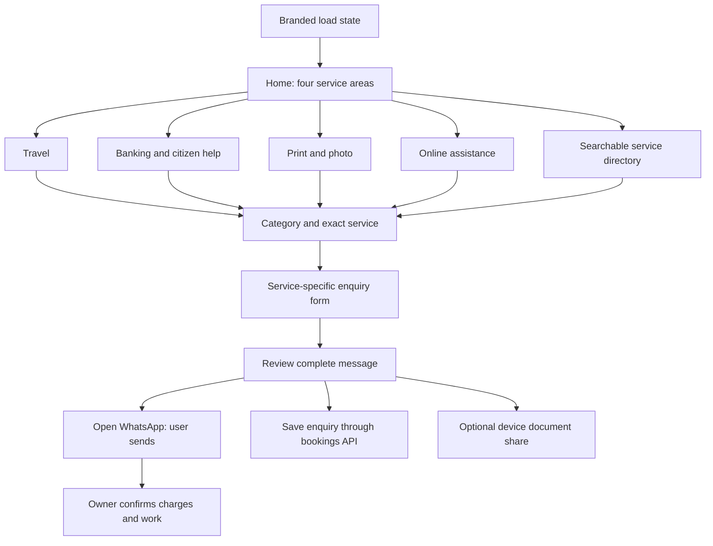
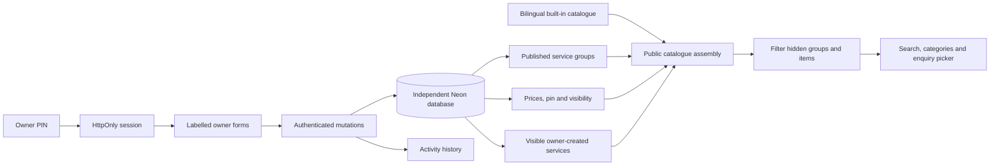
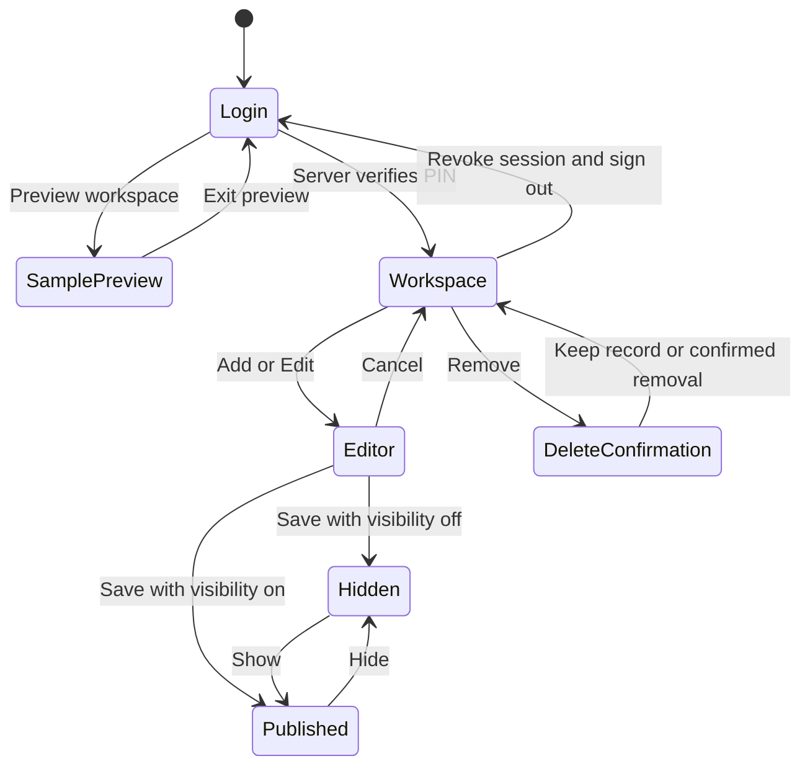

# Replica Click / Ankit Tours: audit and redesign contract

Reviewed 7 September 2026. Original checkout: `D:\Data Science & Analytics\ankit tours nagpur`, commit `62f9a30`. This report records source inspection, not a fresh verification of the production database or the earlier deployment claims.

## 1. Business and content model

Replica Click Online Center & Mini Bank is the umbrella brand. Ankit Tours & Travels is the travel division. Use the supplied logo faithfully on a small white backing in both themes; do not imply government ownership or replace the supplied brand with a state emblem. The centre is near Bank of India, Kondhali, Nagpur. Contact/WhatsApp: +91 7276066532. Existing site hours are 9 AM–9 PM; describe these as listed hours and ask visitors to call before holiday travel. Maps points to the supplied nearby landmark, not a verified shop coordinate.

The audience includes Marathi-speaking residents, people completing online applications, print customers, and travellers. EN + Marathi is the default. English-only and Marathi-first modes are device preferences. The primary action is to find a service, understand its requirements/charges, and make an enquiry. There is no online payment, guaranteed booking, identity verification, government approval or instantaneous bank transaction in the website workflow.

Inventory extracted directly from `assets/data/replica-services.json` and the existing travel page:

| Area | Categories | Individual services | Customer input |
|---|---:|---:|---|
| Travel | 1 | 6 | date, passenger count, pickup, destination, vehicle preference |
| Banking & citizen assistance | 8 | 43 | selected work, contact details, optional deadline |
| Print/photo/documents | 1 | 7 | colour, size, copies, pages, instructions |
| Online assistance | 4 | 22 | selected work, contact details, deadline, instructions |
| Total | 14 including travel | 78 | always name, mobile and consent |

Full English/Marathi item list is in `SERVICE_INVENTORY.md`. Keep the existing built-in IDs (`category-1`, `category-2`, etc.) stable: prices and visibility are keyed to them. Never reorder or remove seed array entries without an explicit migration of their settings. New owner-created services have database IDs and `custom-ID` public IDs.

## 2. What the source actually implements

- Plain HTML/CSS/JavaScript, Vercel functions and `@neondatabase/serverless`. No React or bundler was needed for this redesign.
- Four group routes, searchable assistance categories, six travel services, fleet, packages and WhatsApp enquiries.
- A server-side owner PIN creates an eight-hour opaque session in `owner_sessions` and an HttpOnly cookie. Login/logout are audited.
- Owner settings provide prices, price notes, visible/hidden state and pinned services. Custom services are now handled by `/api/service-groups?kind=custom`, **not** the previously reported separate custom-services endpoint.
- Drivers have private records and a restricted public projection. Coarse `available`/`assigned` state exists; actual calendar availability, driver assignment and customer trip-token journeys are not complete simply because related tables exist.
- Documents are shared using the browser's file share facility or manually attached in WhatsApp. Selecting a file does not upload it to the server, and a `wa.me` URL cannot attach local bytes.
- The current checkout contains 12 serverless entry points including audit, rather than the older endpoint list in chat.

## 3. Findings and actions

| Finding | Effect | Action in this redesign |
|---|---|---|
| Mixed homepage, shared CSS and old route-specific scripts | Overlapping styles, inconsistent layouts and theme behavior | New active frontend under `web/`, single tokens and preference controller |
| Theme button cycles through light/dark/system without an obvious current mode | A click can seem to do nothing if device mode resolves to the current colour | Explicit labelled theme select on every page; light default; immediate pre-paint preference |
| Owner fetched the public vehicle/package/gallery/review feed | A hidden item disappeared after reload, preventing restoration | `?all=1` requires owner authentication and returns all records; public GET remains filtered |
| Audit endpoint selected `summary`, but initialization schema omitted it | Activity history failed on a normally initialized database | Select shared schema columns and use explicit parameterized filtered queries |
| Driver edit UI offered fields that PUT did not update | Experience and eligible vehicles could silently fail to persist | Driver PUT updates these fields and reports missing record/invalid state |
| Public fallback can replace failed live publication reads with seed data | Hidden services and stale prices may reappear | Hosted catalogue fails closed with contact/retry state; only loopback preview uses samples |
| Enquiries silently ignored server-save failures | Users could mistake prepared text for a received booking | Separate review, WhatsApp send and inbox status; show save failures truthfully |
| Message API truncated to 1,000 characters | Bilingual details could be silently cut off | Explicit 4,000-character limit with validation; enquiry details remain bounded |
| Generic foreign/stock images were labelled as exact vehicles or local places | Misleading visual claims | No seed gallery or reviews on public preview; use existing representative vehicle illustrations, and publish owner photos only when configured |
| Native prompt editing and overloaded toolbars | Difficult owner workflow on phones | Labelled editor dialogs, live card preview, clear hide/delete distinction and grouped navigation |

## 4. Architecture and routes

Public routes: `/`, `/travel/`, `/banking-services/`, `/print-photo/`, `/online-services/`, `/contact/`. Legacy `/services/...` links resolve to the relevant new screen. New owner groups use the generic group route and selected category mappings. Hidden/unpublished groups are not admitted into the public catalogue. `/admin.html` is the owner entry, and `/owner/` is its alias.

Public page structure is generated by `web/app.js`. `web/catalog.js` is the only new public service assembly layer. `web/shared.js` handles the header, footer and modal primitives. `web/owner.js` has a declarative field schema for each editable record type. The build generates pages from one shell, avoiding seven diverging copies of navigation and stylesheet code. Old frontend files are archived in `legacy/` and never enter the build output.

## 5. Visual and interaction design

The visual direction is a professional neighbourhood service centre: readable, direct, lightly coloured surfaces, clear rows and restrained glass on the header and contact dock. The homepage combines a plain-language introduction with a compact four-area service board, followed by category cards and the directory. It does not present an enormous mixed list before visitors choose an area.

| Token | Light | Dark |
|---|---|---|
| Background | `#f3f5f8` | `#15191e` |
| Surface | `#ffffff` | `#1e242b` |
| Main text | `#14273c` | `#edf2f7` |
| Muted text | `#5a6b7b` | `#b1becc` |
| Border | `#dce3ea` | `#39434f` |
| Main brand | `#183f67` | `#a2c5ee` |

Travel, banking, print and online sections use separate accent/tint pairs. Dark mode supplies its own colours; do not mix a hard-coded white card with inherited dark-mode white text. Body typography is 16px with DM Sans and a Devanagari-capable fallback; headings use Manrope. Google Fonts is optional at runtime because system font fallbacks remain available. The provided logo is the main image; inherited CSS vehicle illustrations remain explicitly representative and support the user's earlier illustration/photo choice.

Glassy surfaces use a translucent background, `backdrop-filter: blur(22px)` and `-webkit-backdrop-filter`, a subtle border, and rounded edges. Text remains opaque. The fallback remains a readable nearly-opaque surface if blur is unsupported. Normal document panels use solid backgrounds for clarity. Do not apply blur to an element containing text (that would blur the text itself).

Motion is limited to 200–400ms hover elevation, a short initial entrance, vehicle tilt and the contact dock sliding out of view. `prefers-reduced-motion: reduce` disables transitions and animations. No auto-opening service ads or quote prompts. Contact dock appears briefly while scrolling upward and does not hide while hovered/focused. Call and WhatsApp also remain in the normal header/footer so auto-hide is not the only access path.

Category lists use native `details/summary`, with one category initially open, all matching categories opened on search, and a plus/minus indicator. Search matches English name, Marathi name, English category and Marathi category. Buttons are keyboard accessible, filters expose selected state, result counts use an aria-live region, and the enquiry modal uses native dialog focus behavior.

On narrow screens, cards become one column, directory sidebar becomes a horizontal category list, form fields stack, and header navigation moves into a labelled menu. No public actions require hover. Owner tables scroll horizontally within their container rather than overflowing the page. Contacts, language and theme controls remain accessible.

## 6. Owner workflow

Preview is explicitly read-only, contains only local sample content, and never opens private APIs. It is not an authentication bypass. All actual mutations remain guarded on the server. Owner forms default new items to hidden; saving has a clear publication note. Group `draft` state is preserved separately from visibility. Other item types use visibility and are not advertised as having a full revision/publish system.

Owner sections: Overview, Services & Prices, Service Areas, Vehicles, Travel Packages, Enquiry Inbox, Driving Team, Gallery, Reviews and Activity Log. Built-in price settings include travel IDs. Custom services can be added to any existing category including travel. Visibility can be reversed after reload because owner feeds include hidden records. New categories beyond the 14 current categories require a catalogue/schema extension; selecting a service group alone does not invent new category definitions.

Booking states are `new`, `confirmed`, `done`, `cancelled`. State changes are authenticated and audited. Public driver cards disclose display name, languages, experience and coarse status only; phone, legal name and notes never appear in public markup. The status is not a real-time reservation guarantee.

## 7. Enquiries and files

1. Select an exact service from any category or a vehicle/package preference.
2. The form carries that selection forward; name, valid Indian mobile and consent are required.
3. Travel requires route, date and passengers. Print collects colour/size/copies/pages. Other work has an optional deadline.
4. Review a complete bilingual message. Edit returns to the filled form without losing a selected file.
5. Opening WhatsApp uses an encoded `wa.me` message. It does not send automatically. The visitor checks the recipient and presses Send.
6. Website inbox save runs independently and reports success/reference or failure. A failed inbox does not block the WhatsApp link. Preparing/reviewing alone does not save.
7. Optional PDF/JPG/PNG is limited to 5 MB. On compatible devices `navigator.share({files,text})` opens the device share sheet; the user must choose WhatsApp and the owner. Otherwise the user attaches the file manually. File bytes never enter the bookings API, local storage or server logs.

Do not label this a managed upload. A future true upload feature needs private storage, expiring owner downloads, retention/deletion, file scanning and explicit consent. This redesign deliberately documents that incomplete capability instead of displaying a false upload-success state.

## 8. Build, staging and outstanding production work

The static preview binds only to 127.0.0.1:4185, serves only `web/` and `assets/`, and returns 503 for all API requests. It cannot mutate the original database. No `.git`, `node_modules`, `.vercel`, or actual `.env` credentials were copied. All work is inside the sibling redesign folder.

`node scripts/build.mjs` emits the public shell, route HTML, active scripts/styles, logo and data into `dist/`. Vercel uses `outputDirectory: dist`; serverless functions remain at root `api/`. The function count remains 12. `legacy/`, documentation, environment files and backend source are not served by the local static preview or copied into the web build.

Before hosting, use a separate staging database and configure required runtime variables. Run the existing initialization script only after verifying that target. Verify real login/logout, owner CRUD, hidden/public feeds, enquiry persistence and audit entries against staging. The current run does not create a database, alter the existing deployment or validate its live data.

Remaining production decisions: login/public enquiry abuse protection, server-owned private file storage, calendar availability and driver assignment, owner confirmation of real photos/reviews/prices/hours, and full localization review by the owner. These are explicit limits, not claims of completed features. Do not publish sample testimonials or label stock photographs as exact local vehicles/locations.
